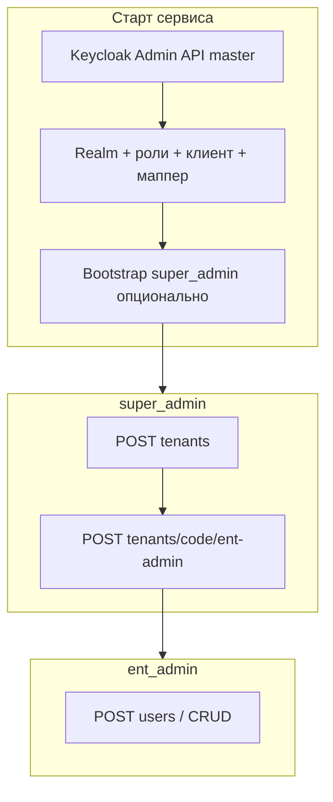

# Полный флоу работы с auth-service

Документ описывает роли, откуда берётся супер-админ, как появляется администратор предприятия, как создаются пользователи и как проходит вход в систему. Техническая база: **Keycloak** (realm приложения) и **PostgreSQL** (учёт предприятий и кэш пользователей).

---

## 1. Компоненты и термины

| Компонент | Назначение |
|-----------|------------|
| **Keycloak “master”** | Административный realm Keycloak. Логин `admin` из `docker-compose` — только для консоли Keycloak (`KEYCLOAK_ADMIN_*`), не для вашего API. |
| **Realm приложения** | По умолчанию `industrial-sed` (`KEYCLOAK_REALM`). Здесь живут пользователи продукта, роли и OAuth-клиент `auth-service`. |
| **Роли realm** | Кроме базовых ролей и ролей склада/СЭД добавлены роли производства **`prod_*`** (для **production-service**) и роли закупок **`proc_admin`**, **`proc_buyer`**, **`proc_approver`**, **`proc_viewer`** (для **procurement-service**). |
| **Группа тенанта** | В Keycloak для каждого предприятия создаётся группа `tenant_<code>` с атрибутом `tenant_id`. Пользователь «принадлежит» предприятию через членство в группе. |
| **Логин пользователя** | Формат **`короткое_имя@код_тенанта`** (например `ivanov@romashka`). Поле `preferred_username` в JWT совпадает с этим логином. |


---

## 4. Вход в систему и получение JWT

### 4.1. Основной сценарий для людей (браузер + SPA)

Предназначен для интерактивного входа:

1. Клиент открывает **`GET /api/v1/auth/login?return_to=/…`** — редирект на Keycloak (OIDC + PKCE).
2. Пользователь входит в Keycloak.
3. Редирект на **`GET /api/v1/auth/callback`** — обмен `code` на токены, установка httpOnly cookies (`access`, `refresh`, опционально `id_token`).
4. **`GET /api/v1/auth/me`** с JWT — информация о текущем пользователе (через middleware).

Дальше сессия живёт в cookies, а обновление/выход делаются через:

### 4.2. Refresh токенов (обновить access/refresh cookies)

**`POST /api/v1/auth/refresh`**

- **Что передавать**: ничего в body передавать не нужно. Клиент должен отправить cookie **`refresh_token`** (httpOnly), полученную ранее на callback.  
  В браузере важно делать запрос с включёнными cookies (например `fetch(..., { credentials: "include" })`).
- **Что происходит**: сервис вызывает refresh в Keycloak и перезаписывает cookies:
  - `access_token` (короткоживущий access JWT),
  - `refresh_token` (refresh),
  - `id_token` (если Keycloak вернул; используется для SSO logout).
- **Ответ**: **`204 No Content`**.
- **Ошибки**:
  - `401` — если нет `refresh_token` cookie или refresh отклонён в Keycloak.

### 4.3. Logout (выйти и завершить SSO-сессию)

**`POST /api/v1/auth/logout`**

- **Что передавать**: ничего в body. Если есть cookies `refresh_token` и `id_token`, сервис использует их.
- **Что происходит**:
  - пытается отозвать refresh token в Keycloak (best-effort);
  - очищает cookies `access_token`, `refresh_token`, `id_token` (MaxAge = -1).
- **Ответ**: `200 OK` + JSON:

```json
{ "end_session_url": "https://<keycloak>/realms/<realm>/protocol/openid-connect/logout?..." }
```

`end_session_url` — это URL для завершения SSO-сессии в Keycloak. Клиент обычно делает редирект пользователя на этот URL (или открывает его в браузере), чтобы гарантированно завершить SSO.

### 4.4. Что попадает в access token

Keycloak кладёт в токен роли realm (`realm_access.roles`). Claim **`tenant_id`** появляется благодаря мапперу из атрибута пользователя — для пользователей предприятия атрибут задаётся при создании; у супер-админа tenant в продуктовой модели может быть пустым — см. ваши проверки в handlers.

---

## 5. Иерархия: кто что может

| Роль | Кто назначает | Что делает в API |
|------|----------------|------------------|
| **`super_admin`** | Bootstrap при старте и/или вручную в Keycloak | `POST/GET/DELETE /api/v1/tenants`, `POST /api/v1/tenants/:code/ent-admin` |
| **`ent_admin`** | Только **`super_admin`** через `POST .../ent-admin` (первый админ) | `POST/GET /api/v1/users`, `PUT .../roles`, `DELETE ...` в своём тенанте |
| **`approver`**, **`engineer`**, **`viewer`** | **`ent_admin`** при создании пользователя или смене ролей | Нет доступа к управлению тенантами/пользователями через эти хендлеры (только свои бизнес-эндпоинты в других сервисах, если вы их добавите) |
| **`warehouse_admin`** | **`ent_admin`** (или вручную в Keycloak) | Полный доступ к **warehouse-service**: справочники (товары, склады, ячейки, цены), импорт, все операции |
| **`storekeeper`** | **`ent_admin`** / Keycloak | Операции склада (приход/расход/перемещение/инвентаризация/резервы), чтение остатков и отчётов |
| **`warehouse_viewer`** | **`ent_admin`** / Keycloak | Только чтение в **warehouse-service** (остатки, движения, отчёты, справочники) |
| **`sed_admin`** | **`ent_admin`** / Keycloak | Справочники СЭД в **sed-service**: типы документов, маршруты согласования и шаги |
| **`sed_author`** | **`ent_admin`** / Keycloak | Создание и редактирование черновиков, отправка на согласование, подпись, отмена, вложения |
| **`sed_approver`** | **`ent_admin`** / Keycloak | Согласование / отклонение документов, очередь задач `/tasks` |
| **`sed_viewer`** | **`ent_admin`** / Keycloak | Только чтение документов и истории в **sed-service** |
| **`prod_admin`** | **`ent_admin`** / Keycloak | Полный доступ к **production-service** (справочники, BOM, маршруты, заказы) |
| **`prod_technologist`** | **`ent_admin`** / Keycloak | BOM и техкарты (routing), отправка на согласование в СЭД |
| **`prod_planner`** | **`ent_admin`** / Keycloak | Производственные заказы, release/cancel/complete, сменные задания |
| **`prod_master`** | **`ent_admin`** / Keycloak | Старт/отчёт/финиш операций заказа |
| **`prod_worker`** | **`ent_admin`** / Keycloak | Наряды «мои», отчётность по операциям (совместно с master) |
| **`prod_qc`** | **`ent_admin`** / Keycloak | Зарезервировано под контроль качества |
| **`prod_viewer`** | **`ent_admin`** / Keycloak | Только чтение в **production-service** |
| **`proc_admin`** | **`ent_admin`** / Keycloak | Полный доступ к **procurement-service** (поставщики, PR/PO, приемка) |
| **`proc_buyer`** | **`ent_admin`** / Keycloak | Создание и ведение PR/PO, отправка на согласование, приемка по PO |
| **`proc_approver`** | **`ent_admin`** / Keycloak | Роль согласующего для закупочных документов (через **sed-service**) |
| **`proc_viewer`** | **`ent_admin`** / Keycloak | Только чтение в **procurement-service** |

Маршруты защищены так:

- `/api/v1/tenants/*` — JWT + роль **`super_admin`**.
- `/api/v1/users/*` — JWT + роль **`ent_admin`**; тенант берётся из токена (`tenant_id`).

---

## 6. Полный сценарий «с нуля» до инженера в предприятии

Ниже — типичная последовательность для локальной/тестовой среды.

### Шаг A. Супер-админ входит и получает токен

Через браузер: OAuth как в п. 4.1.  
Для скриптов в dev (если включено `ENABLE_TEST_ENDPOINTS`): см. `POST /api/v1/internal/test/login` с заголовком `X-Test-Secret` — password grant от имени клиента `auth-service` (см. `docs/TESTING.md`).

### Шаг B. Супер-админ создаёт предприятие (тенант)

**`POST /api/v1/tenants`**  
`Authorization: Bearer <access_token super_admin>`  

Тело (пример):

```json
{ "code": "romashka", "name": "Ромашка ООО" }
```

В Keycloak создаётся группа `tenant_romashka`, в БД — запись предприятия.

### Шаг C. Супер-админ создаёт первого администратора предприятия (`ent_admin`)

Это **единственный** штатный способ появления первого `ent_admin` через API:

**`POST /api/v1/tenants/romashka/ent-admin`**  

```json
{
  "username": "ivanov",
  "email": "ivanov@example.com",
  "password": "НадёжныйПароль123"
}
```

Результат:

- В Keycloak пользователь с логином **`ivanov@romashka`**, роль **`ent_admin`**, член группы `tenant_romashka`.
- Запись в локальном кэше пользователей.

Дальше **`ivanov@romashka`** логинится через тот же OIDC поток и вызывает API пользователей своего тенанта.

### Шаг D. Администратор предприятия добавляет сотрудников

**`POST /api/v1/users`**  
`Authorization: Bearer <access_token ent_admin>` — в токене должен быть `tenant_id`, совпадающий с предприятием.

Тело (пример полей — см. Swagger / `handlers`): задаются локальное имя, email и роль из набора **`ent_admin` | approver | engineer | viewer** (не `super_admin`).

Сервис:

- создаёт пользователя `имя@<tenant из токена>` в Keycloak;
- задаёт пароль (генерируется), группу тенанта и realm-роль;
- пишет кэш и шлёт событие в notifier (Kafka/mock).

Выданный пароль передаётся администратору (в ответе API) для первой выдачи пользователю по вашему процессу.

---

## 7. Внутренние вызовы сервис-сервис

| Эндпоинт | Заголовки | Назначение |
|----------|-----------|------------|
| **`GET /api/v1/internal/userinfo`** | `X-Service-Secret`, `Authorization: Bearer <JWT пользователя>` | Прокси-профиль для бэкендов: проверка секрета + валидация JWT. |

Секреты задаются в конфиге: `SERVICE_SECRET`, для тестовых ручек — `TEST_SECRET`. При ошибке аутентификации API возвращает обобщённое сообщение, без раскрытия типа секрета.

---

## 8. Полезные проверки и отладка

- **Админка Keycloak** (realm `industrial-sed`): пользователи, роли, группы, **Required user actions** — если вход по password grant падает с «учётка не готова», часто мешают required actions или профиль (имя/фамилия в KC 24+).
- **Swagger**: `GET /swagger/index.html` при запущенном сервисе.
- Подробности по pytest и curl: **`docs/TESTING.md`**.

### 8.1. Принудительная смена пароля через неделю (вариант A)

Сервис поддерживает фоновую задачу: **спустя N времени после создания** пользователю в Keycloak выставляется required action **`UPDATE_PASSWORD`**. Тогда при следующем интерактивном входе Keycloak попросит сменить пароль.

Настройка через env:

- `PASSWORD_ROTATION_ENABLED=true|false`
- `PASSWORD_ROTATION_AFTER=168h` (через сколько после создания требовать смену)
- `PASSWORD_ROTATION_EVERY=10m` (как часто выполнять проверку)
- `PASSWORD_ROTATION_BATCH=200` (сколько пользователей обрабатывать за цикл)

Важно: если вы используете password grant (`/api/v1/internal/test/login`), то для пользователей с required action `UPDATE_PASSWORD` Keycloak может отвечать `invalid_grant` / `Account is not fully set up`. Это ожидаемо — password grant не умеет интерактивно выполнять required actions.

---

## 9. Схема зависимостей (кратко)



Итог: **супер-админ** появляется из конфига при старте (или вручную в Keycloak); **администратор предприятия** создаётся только **супер-админом** через `.../ent-admin`; **остальные пользователи** — **администратором предприятия** через `/api/v1/users`.
